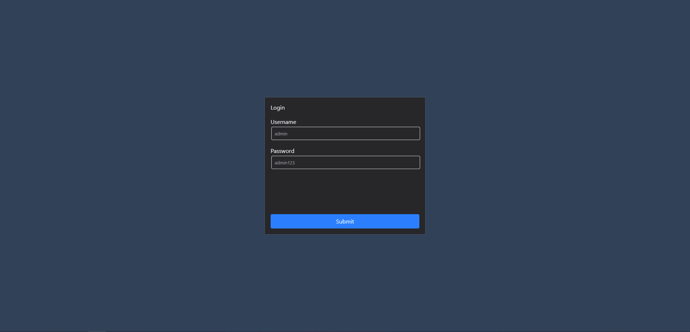
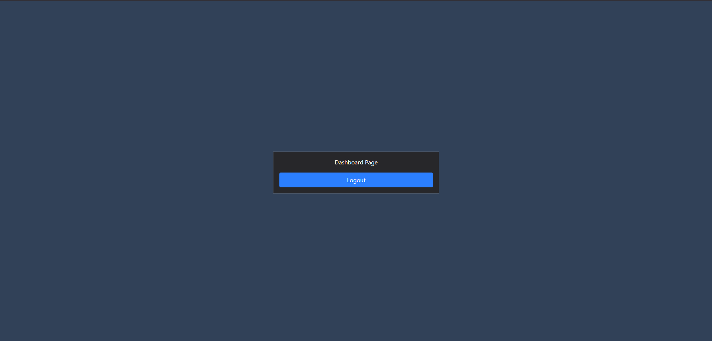

# Mid Level Task

## How To Run
```
pnpm install
pnpm run server
pnpm run dev
```

>NOTE keep in mind, follow the task description were talk about 4 part, i have just handled the the first part in (which was authentication and session management part)


## Screen Shots



